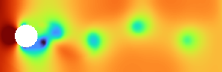
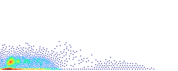

### Online demo: https://alexander-barth.github.io/FluidSimDemo-WebAssembly/

[FluidSimDemo.webm](https://user-images.githubusercontent.com/9881475/232729285-acb24bd8-e97d-4ce6-b9f2-84a625cdb1f9.webm)

WebAssembly or WASM is a low level instruction set which allows running compiled language
inside a WebBrowser. For example C and Rust code can be compiled to WASM and then loaded and executed by the Browser runtime.

Technically one could also run interpreted language like Python (implemented in C)
in a webbrowser by compiling the interpreter to WASM (in the case of python, this is the goal of the [pyodide](https://pyodide.org/) project).
A similar approach was undertaken by Keno Fisher porting [julia 1.3 to WASM](https://github.com/Keno/julia-wasm) using emscripten.

On the other hand, a subset of Julia can also be compiled ahead-of-time using GPUCompiler.jl/StaticCompiler.jl. WASM is one of the enabled output targets of the LLVM compiler bundled in julia.

Encouraged by post of running [Julia with StaticCompiler.jl](https://seelengrab.github.io/articles/Running%20Julia%20baremetal%20on%20an%20Arduino/)  on an Arduino, how difficult could it be to run a non-trivial julia code in a WebBrowser using WASM?

This approach here uses a subset of the Julia language and the array object of StaticTools.jl to create a small WASM program. In particular we should have:
* No dynamic memory allocation and garbage collector
* No code that could throw an exception (in particular no bounds checks)
* Only scalars and arrays of integer and floats can be used between JavaScript and Julia (in particular no boolean arrays).

Luckily, the julia programming language does not get in your way to write low-level code. However it is possible to use higher-level constructs like tuples and named tuples inside the julia code but such data structures cannot be (easily) made available in JavaScript.


## Perequisites

* Julia 32-bit from https://julialang.org/downloads/
* The command line tools  `wasm-ld` and `wasm2wat`
* Compiler clang
* For testing, it is useful to use JavaScript runtime node

On Ubuntu 22.04, these requirements can be install by:

```bash
sudo apt install wabt clang lld nodejs
```

To install all julia dependencies, start the 32-bit version of julia and run:

```julia
using Pkg
Pkg.activate("/path/to/this/source/code")
Pkg.instantiate()
```

The source code of the fluid model is in a separate repository: https://github.com/Alexander-Barth/FluidSimDemo.jl

## Generating WASM binary from julia code

We will use `GPUCompiler.jl` to declare a `WASMTarget` and to emit WASM code. This is the file [`wasm_target.jl`](wasm_target.jl) which we will use.

Note that we use 32-bit julia (on Linux) and 32-bit WASM format.
Using the 64-bit version (of julia or the WASM format) did not work for me.

One of the simplest functions would be to add two integers and return the sum. 

```julia
include("wasm_target.jl")

function add(a::Int32,b::Int32)
    return a+b
end

obj = build_obj(add, Tuple{Int32,Int32})

write("test_add.o", obj)
```

The wasm object file is saved to `test_add.o` which can be inspected by `wasm2wat`.

```
$ wasm2wat test_add.o 
(module
  (type (;0;) (func (param i32 i32) (result i32)))
  (import "env" "__linear_memory" (memory (;0;) 0))
  (func $julia_add (type 0) (param i32 i32) (result i32)
    local.get 1
    local.get 0
    i32.add))
```

Note that the function add has been prefixed by `julia_`.

The linker step is necessary to export the `julia_add` function.

```
wasm-ld --no-entry --export-all -o test_add.wasm test_add.o
```

To test the WASM binary, it is convenient to use `node`. The code can be executed by running:

```bash
node test_add_node.js
```

where `test_add_node.js` is the file:

```javascript
const fs = require('fs');

const wasmBuffer = fs.readFileSync('test_add.wasm');
WebAssembly.instantiate(wasmBuffer).then(wasmModule => {
    // Exported function live under instance.exports
    const { julia_add, memory } = wasmModule.instance.exports;

    // Call the function and display the results.
    const result = julia_add(2,3)
    console.log(result);
});
```


## Using arrays

The Julia base array type can unfortunately not be used but the array type of [StaticTools.jl](https://github.com/brenhinkeller/StaticTools.jl)
is accepted by GPUCompiler.jl.

The memory layout is [relatively simple](https://github.com/brenhinkeller/StaticTools.jl/blob/480d7514304190cb6b8e71331d7119959d80e3e2/src/mallocarray.jl#L21-L25):

```julia
 struct MallocArray{T,N} <: DensePointerArray{T,N}
     pointer::Ptr{T}
     length::Int
     size::NTuple{N, Int}
 end
 ```
 
So we have essentially:
* a pointer
* the total number of elements (`length`)
* a tuple with the size along each dimension

The code [`test_matrix_node.js`](test_matrix_node.js) emulates such an array. For a matrix (2D array), there are thus four 32-bit integers: pointer, number of elements, number of lines and number of rows (where the number of elements is the product of the number of rows and lines).

WASM exposes a special binary data buffer `memory.buffer` to allocate such data structures. A pointer would then just be an index or rather offset relative to the start of this byte buffer. Using JavaScript’s typed arrays, a part of the buffer can be interpreted as a vector of 32-bit integer, 64-bit floating point number,...
JavaScript typed arrays are always one-dimensional, which correspond to a flatten view of the array seen from Julia. As a consequence, for
JavaScript typed array there is no additional difficulty concerning row-major or column-major matrix layout.


The example code [`test_matrix.jl`](test_matrix.jl) sums over all elements of a matrix and in addition it mutates all elements by adding 1. Running the JavaScript code [`test_matrix_node.js`](test_matrix_node.js) gives the expected output. As in Julia, scalar parameters (32/64-bit integer, floats) are passed by value while arrays are passed by reference and can thus changes are visible
by the caller.

## Fluid simulation

### 2D Navier-Stokes equations (with rigid-lid)

As a final example we take a simple 2D fluid simulation solving the inviscid and incompressible Navier-Stokes equations.
It is based on the [compact implementation](https://github.com/matthias-research/pages/blob/master/tenMinutePhysics/17-fluidSim.html) of
Matthias Müller reimplemented in Julia:

https://github.com/Alexander-Barth/FluidSimDemo-WebAssembly/blob/main/test_fluid_sim.jl

The generated WASM binary assumes that a `memset` function exists. Lukily, this function is simple enought that we can provide a [C-implementation](https://github.com/Alexander-Barth/FluidSimDemo-WebAssembly/blob/main/memset.c) that can be compiled to wasm with `clang`.

The online demo is [avialable here](https://alexander-barth.github.io/FluidSimDemo-WebAssembly/):

[](https://alexander-barth.github.io/FluidSimDemo-WebAssembly/)


### 2D shallow water equations

The shallow water equations model is similar to the 2D Navier-Stokes equations but the implicit pressure solver is replaced by explicit for the free surface. If the time step is too large, the model can be come unstable.

The online demo is [available here](https://alexander-barth.github.io/FluidSimDemo-WebAssembly/ShallowWater):

[](https://alexander-barth.github.io/FluidSimDemo-WebAssembly/ShallowWater)


### Smoothed-particle hydrodynamics

The online demo is [available here](https://alexander-barth.github.io/FluidSimDemo-WebAssembly/SmoothedParticleHydrodynamics/).


[](https://alexander-barth.github.io/FluidSimDemo-WebAssembly/SmoothedParticleHydrodynamics/)


The julia code is based on [SmoothedParticleHydrodynamics.jl](https://github.com/Alexander-Barth/SmoothedParticleHydrodynamics.jl)


### Gray-Scott equations


Two tracers $u$ and $v$ inteact with the following diffusion-reaction equations:

$$
\begin{alignat*}{2}
\frac{∂u}{∂t} &= D_u ∇²u - u v² + f (1 - u) \\
\frac{∂v}{∂t} &= D_v ∇²v + u v² - (f + k) v
\end{alignat*}
$$

The online demo is [available here](https://alexander-barth.github.io/FluidSimDemo-WebAssembly/GrayScott/).

### Layered ocean model


In a layered ocean model, the ocean is represented by a series of $m$ layers each with a constant density 
$ρ_k$ ($k= 1,...,m$). The thickness ($h_k$) and the velocity ($u_k$) for a 1D vertical section is given by:

$$
\begin{alignat*}{2}
\frac{∂h_k}{∂t} &= - \frac{∂}{∂x}  (h_{m,k} u) \\
\frac{∂u_k}{∂t} &= - \frac{1}{ρ_k} \frac{∂P_{k}}{∂x}
\end{alignat*}
$$

where we have ommit the non-linear terms and the Coriolis force. $h_{m,k}$ is the mean thickness of layer $k$ and the Montgomery potential $P_k$ is determined using:

$$\frac{P_{k+1} - P_{k}}{ρ_{k+1} - ρ_{k}} = g z$$

See Chapter 12 "Layered Models" of Geophysical Fluid Dynamics: Physical and Numerical Aspects, Benoit Cushman-Roisin, Jean-Marie Beckers, Academic Press, 2011.


where p is the pressure, ρ the density, g the acceleration due to gravity and z the vertical coordinate. At the surface  the Montgomery potential P is given by:
$$P_1 = g z_1 ρ_1$$

The online demo is [available here](https://alexander-barth.github.io/FluidSimDemo-WebAssembly/NLayers/).
